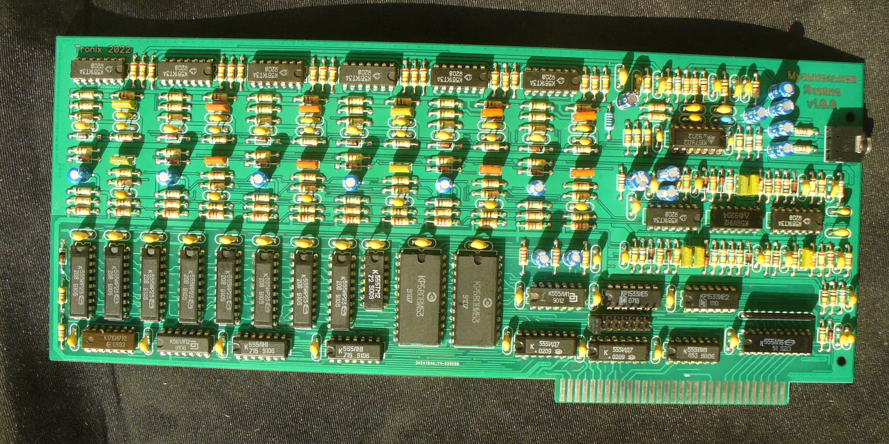
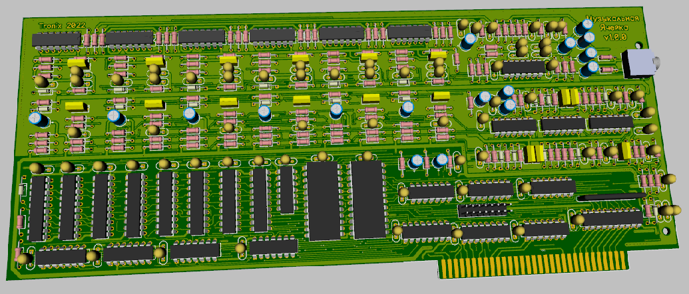
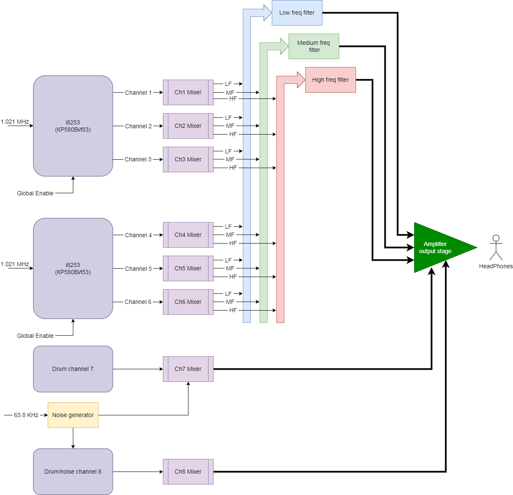

# MuzCell
 Newly made ISA8 sound card. Replica to "Music Sintez Cell" from old soviet "Agat" PC
 

## Prologue
The prototype of this sound card is a "musical cell" from the old Soviet computer "Agat" (partially Apple II compatible). More information about it here: http://agatcomp.ru/agat/Hardware/SoundNCL/jzs52.shtml (in Russian). So, this sound card is based on original Agat's "musical cell" circuit but the necessary changes have been made to work on the PC ISA8 bus. Also, some components have been replaced with more affordable ones, the timer channel with the IRQ handler was removed because the PC already has its own timer as part of the motherboard.

## Description
This sound card based on two i8253 timers IC (KR580VI53 rus). Each i8253 contains three counters channels, two i8253 provide six independed channels. 
* Six counters are masters for the tonal channels. 
* Six tone channel switching units - provide a smooth attack and signal transmission from timers / counters to bandpass filters.
* Passive bandpass RC filters - extract parts of the spectrum in tone channels.
* Noise generator and drum generators (a group of three CMOS IC) - provide two drum channels.

## Programming information
Jumper block J1 select base IO port address. Valid port ranges is 300h,310h,320h,330h,380h,390h,3A0h and 3B0h. The port distribution is as follows:
* 3n0..3n3 - registers of the first i8253 (vi53) (tonal channels 1-3).
* 3n4..3n7 - registers of the second i8253 (vi53) (tonal channels 4-6).
* 3n8..3nD - control of tonal channels switching units.
* 3nE..3nF - percussion channels control.

Ports 3n0-3n7 are available for both writing and reading. Ports 3n8-3nF are write-only.

### Control of switching units of tone channels (IO ports 0x3n8-0x3nD):

* D0 - signal output to the HF channel (harmonics 1..4 kHz (upper frequency is determined by the mixer)).
* D1 - signal output to the midrange channel (harmonics 0.200..1.5 kHz).
* D2 - signal output to the low-frequency channel (harmonics ..1 kHz).
* D3 - low-pass filter (adds about 5 dB at frequencies up to 600 Hz).
* D4 - level impulse. When this bit is set, the amplitude rises sharply, then falls off smoothly (about 0.5 seconds). When reset, it decreases sharply and then gradually recovers. A set bit gives a slight permanent increase in signal level.
* D5 - enable channel. When this bit is set, the amplitude increases rapidly (about 0.1 second) and remains high. When reset, it also decreases rapidly.

Frequency ranges are given approximately, at level 0.5. D5 & D4 = 0 or D0 = D1 = D2 = 0 will give silence on the channel. The amplitude ratio at D5 != D4 was not measured. D0-D3 affect the sound without delay.

### Drum generator, channel 7 (IO port 0x3nE):

* D0 - frequency 2.
* D1 - frequency 1.
* D2 - frequency 0, generator modulation by noise (at D2 = 0).
* D3 - duration.
* D4 - start.

D0-D2 select different master oscillator frequencies (i.e. 8 options are possible). Moreover, with D2 = 0, the master oscillator will periodically twitch (the word "modulation" is somehow not very appropriate here, IMHO) from the noise generator (there is almost no difference by ear). In addition, the channel, in any case, is mixed with noise (in addition to the master oscillator).
Duration (D3) changes the duration of the beat (approximately 0.5 seconds with D3 = 0 and 1.0 seconds with D3 = 1). Switching bit D4 from 0 to 1 causes the sound to be generated, the attack is sharp, the decay is gradual. If you reset the beat while playing, the sound will stop. To generate the sound again, you need to reset D4 and wait about a second (probably even less). However, if the previous activation was short-term, then the time in the zero state can be reduced.

### Drum generator, channel 8 (IO port 0x3nF):

* D0 - frequency 1.
* D1 - frequency 2.
* D3 - duration.
* D4 - start.
* D7 - D7 = 1 - disable all timers/counters.

The control is practically the same as channel 7, the noise generator is constantly connected and always pulls the main generator. Bit D7 controls GATE input of i8253, so if D7=1 all tone channels are stoped.

